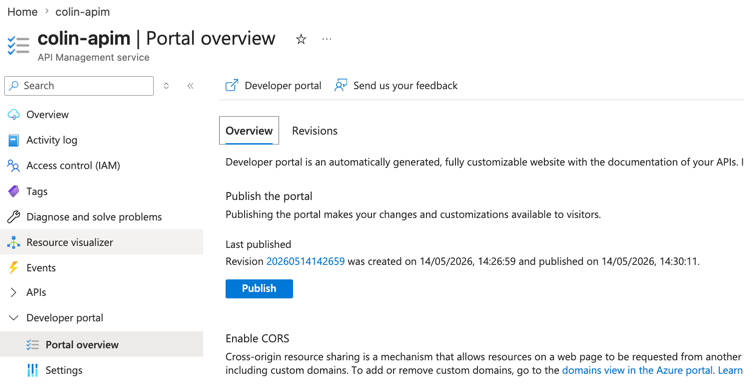
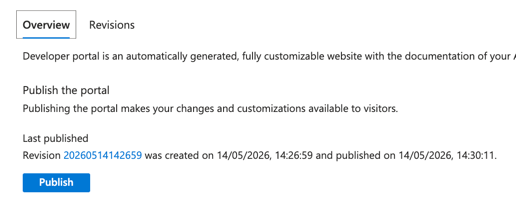
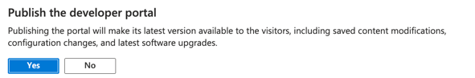
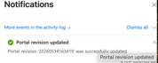
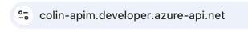
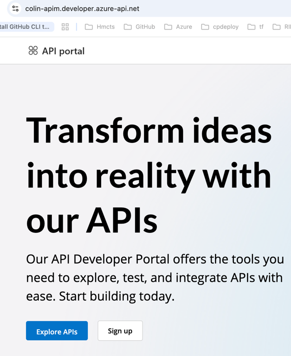
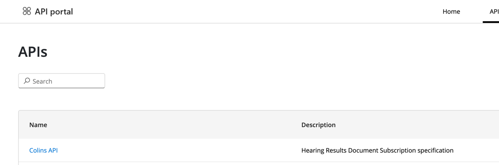
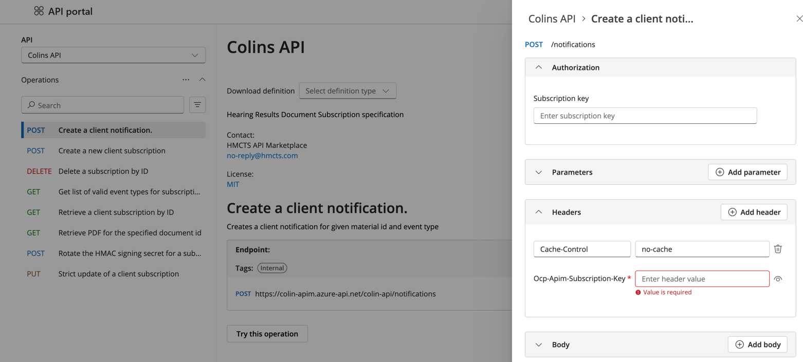

# Azure APIM — Developer Portal Guide

How to navigate the Azure Portal to publish the Developer Portal, and what it looks like once published.

---

## Publishing the Developer Portal manually

After importing APIs, you need to publish the Developer Portal to make them visible to visitors.

### Step 1 — Open Portal overview

In [portal.azure.com](https://portal.azure.com), navigate to your APIM instance (`colin-apim`) and click **Developer Portal → Portal overview** in the left menu.



You will see the current publish status, including when the portal was last published. The **Publish** button is in the centre of the page.



---

### Step 2 — Click Publish

Click the **Publish** button. A confirmation dialog appears:



Click **Yes** to confirm. The portal build starts immediately.

---

### Step 3 — Confirm success

A notification appears in the top-right corner confirming the portal revision was updated:



The portal is now live. Publishing takes ~1–2 minutes and only needs to be done again when you make changes (import new APIs, update policies, etc.).

---

## Viewing the Developer Portal

### Navigate to the portal

Open your Developer Portal URL in a browser:



```
https://colin-apim.developer.azure-api.net
```

---

### Home page

The portal home page loads immediately without requiring sign-in:



Click **Explore APIs** or the **APIs** link in the top navigation to browse the catalogue.

---

### API catalogue

The APIs page lists all published APIs that are visible to the current visitor. Anonymous visitors see any API whose product has the **Guests** group assigned:



**Colins API** is listed here with its description pulled directly from the OpenAPI spec (`Hearing Results Document Subscription specification`).

---

### Selecting an API

Click the API name to open its detail page. All operations from the spec are listed on the left, grouped by HTTP method:



The right-hand panel shows the **Try It** console for the selected operation. You can:

- Enter a subscription key (`Ocp-Apim-Subscription-Key`)
- Add query parameters and headers
- Supply a request body
- Send a live request to the gateway and see the response

> The endpoint shown (`https://colin-apim.azure-api.net/colin-api/notifications`) is the live APIM gateway URL — not the backend service. APIM proxies the request and applies any policies (auth, throttling, transformation) before forwarding it.

---

## What the portal gives you

| Feature | Description |
|---|---|
| **API catalogue** | Searchable list of all published APIs with descriptions |
| **Operation docs** | Full request/response schemas and examples from the OpenAPI spec |
| **Try It console** | Make live calls from the browser without any client setup |
| **Subscription management** | Developers can self-register and get subscription keys |
| **Customisation** | Portal appearance, content, and branding are all editable in the admin editor |
