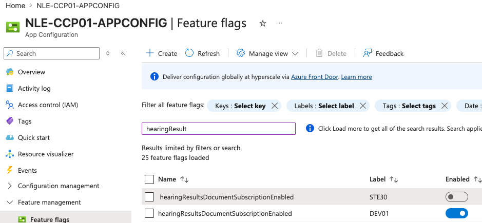

# Azure App Config Demo

Demonstrates querying Azure App Configuration feature flags from Java using `DefaultAzureCredential`.

## What it shows

- `FeatureFlagService.getStatus()` calls Azure App Config directly on each invocation — no caching
- Returns a typed `FeatureFlagStatus` record with `id` and `enabled` fields
- The same flag can have different values per label (e.g. STE30 vs DEV01)

## Feature flags in the portal



The same flag `hearingResultsDocumentSubscriptionEnabled` has different states per environment label:

| Label | Enabled |
|-------|---------|
| STE30 | false   |
| DEV01 | true    |

## Known limitation — developer access

Developers can **read** feature flag values via `az login` but cannot **toggle** them in the portal.
Only DevOps have write permissions to Azure App Config.

This means the live-query pattern is useful for reading flag state, but flipping a flag to test
different behaviour requires a DevOps change — or using a local Spring Boot property override instead.

This demo is kept as a reference and a point of discussion around whether developer write access
to App Config should be granted for lower environments (e.g. DEV01).

## Running the integration test

```bash
az login
AZURE_APP_CONFIG_ENDPOINT=https://NLE-CCP01-APPCONFIG.azconfig.io \
  ./gradlew integrationTest
```

Not wired into the pipeline — requires Azure credentials via `az login`.

## CLI equivalent

```bash
az appconfig feature show \
  --name NLE-CCP01-APPCONFIG \
  --feature hearingResultsDocumentSubscriptionEnabled \
  --label STE30 \
  --query "enabled" --output tsv
```

Or use the script:

```bash
cd scripts && ./query-feature-flags.sh
```
