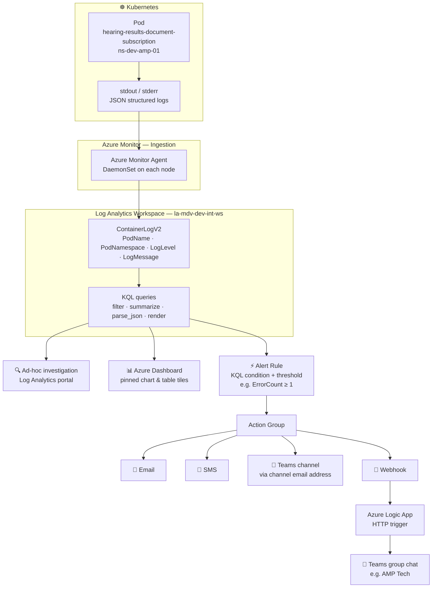

# Azure Monitor Demo

Guides for monitoring `hearing-results-document-subscription` using Azure Log Analytics.

> ⚠️ **Prototyping only** — the portal (clickops) guides here are for learning and prototyping. Production alerts and monitoring infrastructure are deployed via Terraform in [cp-amp-terraform-alerts](https://github.com/hmcts/cp-amp-terraform-alerts).

---

## Architecture overview

---

## Contents

| Guide | Description |
|---|---|
| [queries.md](./queries.md) | KQL queries for the dashboard, ad-hoc investigation, and KQL tips (local time, JSON parsing, chart types, zero-fill) |
| [dashboard.md](./dashboard.md) | How to create dashboard tiles from KQL queries, import/export the dashboard JSON |
| [alerts.md](./alerts.md) | How to set up an Action Group (email + SMS) and an Alert Rule, with rich notification options via Logic App |
| [teams-webhook.md](./teams-webhook.md) | Sending alerts to MS Teams via Workflows webhook — including known Save greyed out issue on HMCTS accounts |
| [logic-app.md](./logic-app.md) | Creating an Azure Logic App to post Teams messages on alert — recommended alternative when Power Automate licences are unavailable |
