# Azure Monitor Alerts

Step-by-step guide for creating an Action Group (email + SMS) and an Alert Rule that fires when a specific error pattern appears in Log Analytics.

> ⚠️ **Prototyping only** — the portal (clickops) steps below are intended to help you understand and prototype alert configuration. Production alerts are deployed via Terraform in [cp-amp-terraform-alerts](https://github.com/hmcts/cp-amp-terraform-alerts). Do not manually create or modify alerts in production environments.

---

## Part 1 — Create an Action Group

An Action Group defines *who gets notified* and *how* when an alert fires.

### Step 1 — Navigate to Azure Monitor

From the Azure Portal home page click the **Monitor** icon under Azure services.

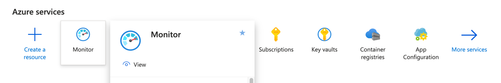

---

### Step 2 — Open Create → Action group

In **Monitor | Alerts** click **+ Create → Action group**.

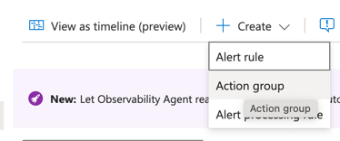

---

### Step 3 — Fill in the Basics tab

Enter the subscription, resource group, action group name and display name.

> The display name is limited to 12 characters — it appears as the sender name on SMS messages.

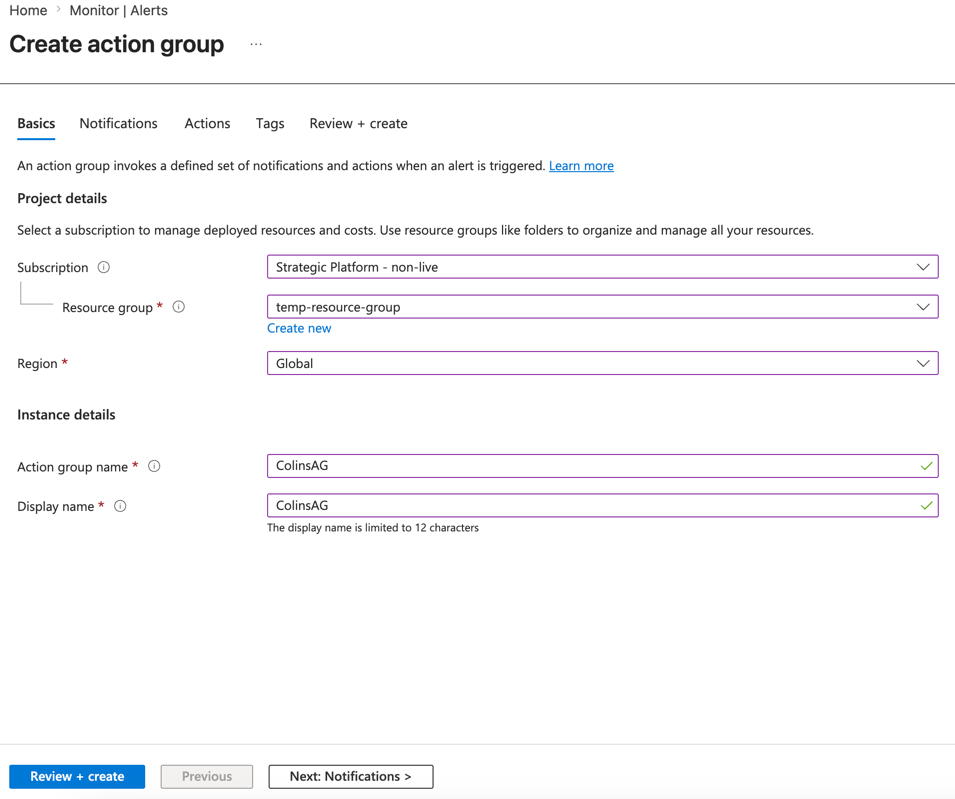

---

### Step 4 — Add email and SMS notifications

Switch to the **Notifications** tab. Set Notification type to **Email/SMS message/Push/Voice** and fill in the email address and mobile number on the flyout panel. Click **OK**.

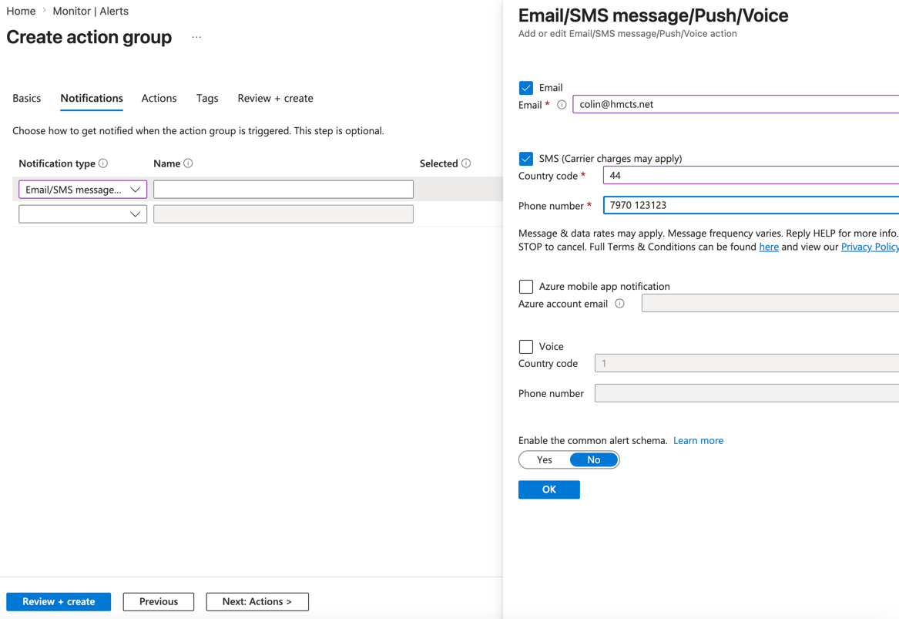

---

### Step 5 — Skip the Actions tab

The **Actions** tab is for webhooks, Logic Apps etc. Leave it empty for a basic email/SMS setup and click **Next: Tags >** then **Review + create**.

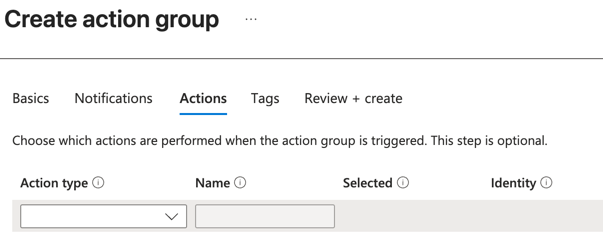

---

### Step 6 — Review and create

Confirm the summary shows the correct notification type (Email/SMS) and click **Create**.

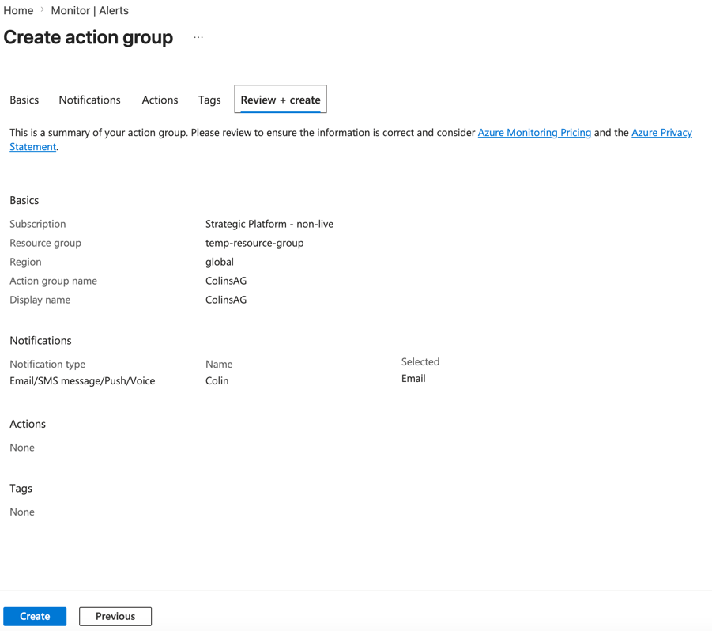

---

### Step 7 — Action group created

The action group overview confirms it is active with Email and SMS notifications configured.

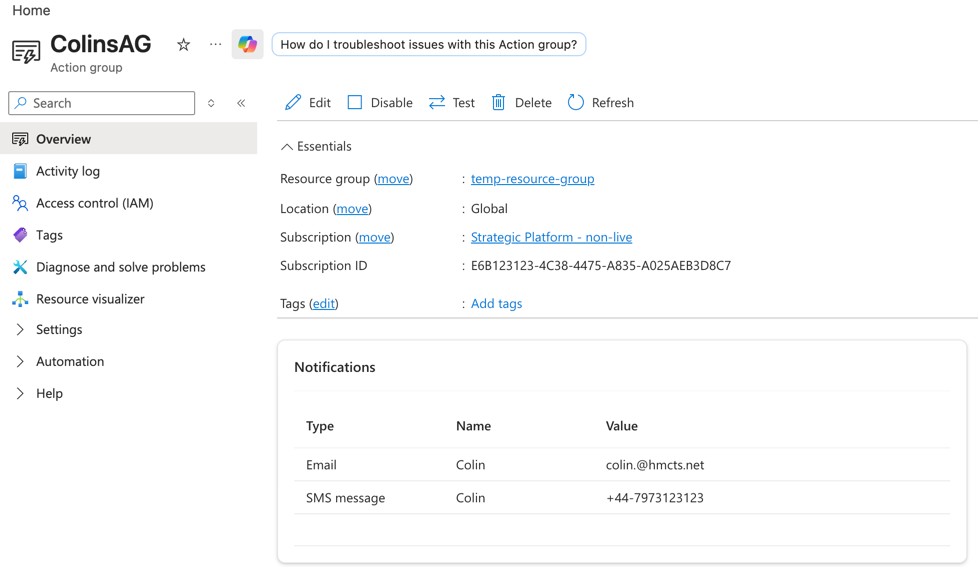

---

## Part 2 — Create an Alert Rule

The alert rule watches Log Analytics and triggers the Action Group when the KQL condition is met.

### Step 1 — Open Create → Alert rule

In **Monitor | Alerts** click **+ Create → Alert rule**.

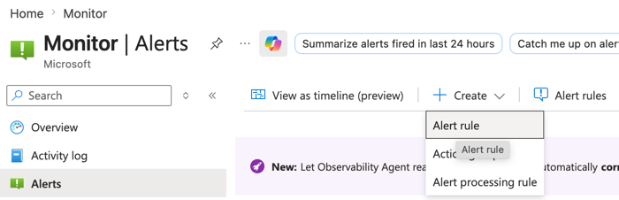

---

### Step 2 — Set the Scope

On the **Scope** tab click **+ Select scope** and choose your **Log Analytics Workspace** as the resource.

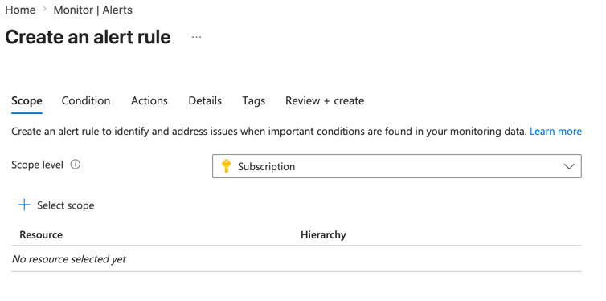

---

### Step 3 — Define the Condition (KQL query)

On the **Condition** tab set Signal name to **Custom log search** and paste your KQL query. The Log Analytics editor opens in a side panel so you can test the query before saving.

```kql
ContainerLogV2
| where PodNamespace == 'ns-dev-amp-01'
| where ContainerName != 'istio-proxy'
| where PodName contains 'hearing-results'
| where LogLevel == 'error'
| where LogMessage contains 'ResponseStatusException'
```

Set **Measure** to `Table rows`, **Operator** to `Greater than or equal to`, **Threshold** to `1`.

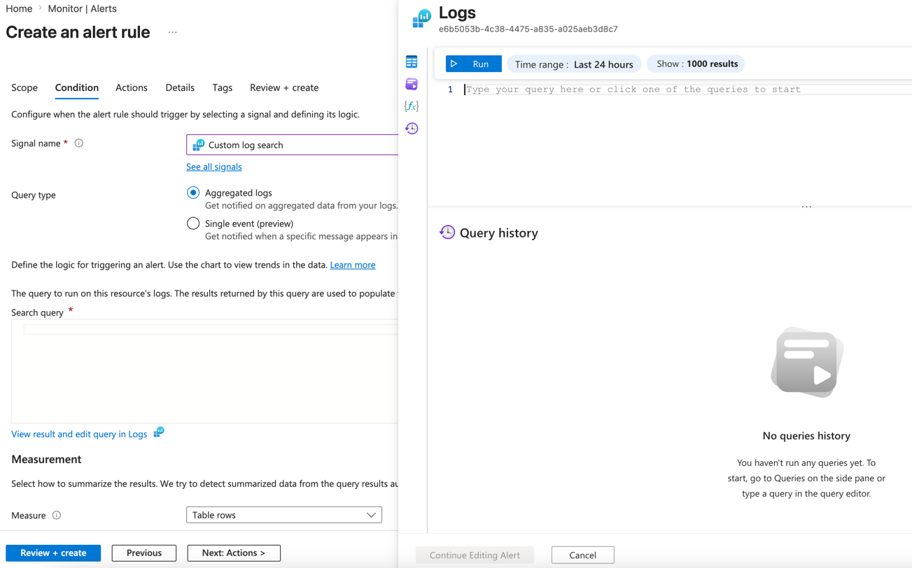

---

### Step 4 — Attach the Action Group

On the **Actions** tab select **Use action groups**, click **+ Select action groups** and choose the group created in Part 1. You can also customise the **Email subject** here.

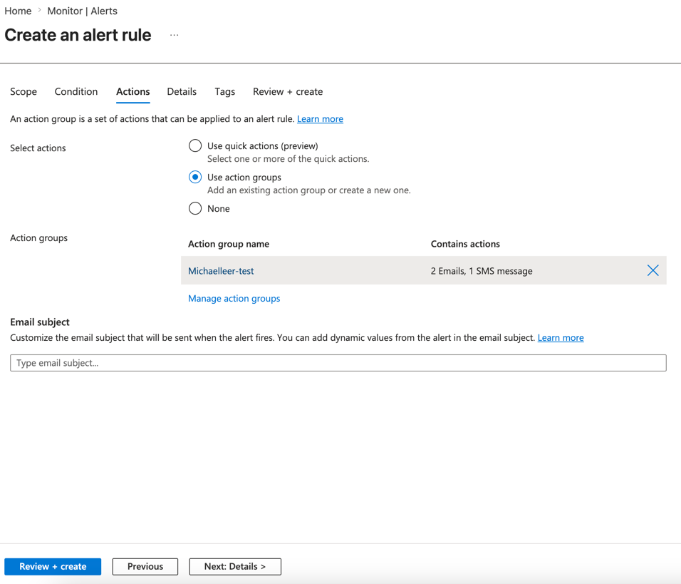

---

### Step 5 — Fill in the Details tab

On the **Details** tab set the subscription, resource group, severity, alert rule name and region.

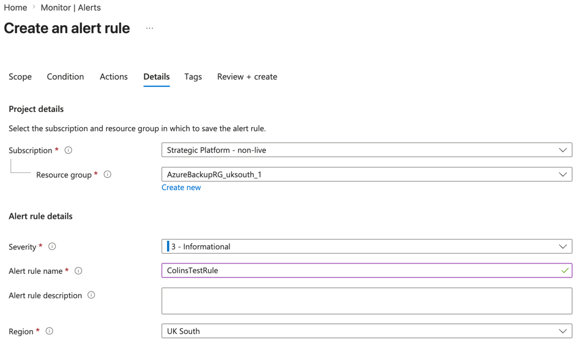

---

### Step 6 — Review and create

The **Review + create** tab shows a summary of scope, condition, actions and estimated monthly cost. Click **Create**.

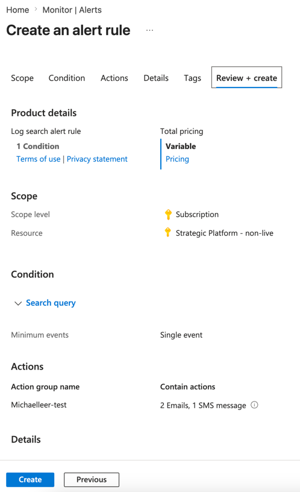

---

### Step 7 — Alert rule created

The alert rule overview shows the scope (workspace), the KQL condition, and the linked action group. Use **Edit**, **Disable**, **Duplicate** or **Delete** from the toolbar to manage it.

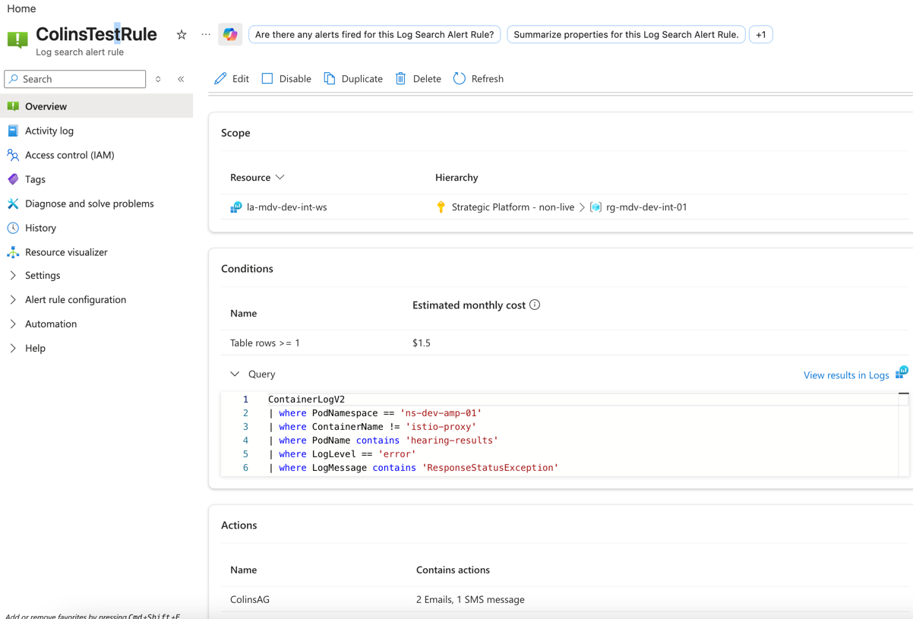

---

## Part 3 — Alert fires

When the KQL condition is matched you will receive both an email and an SMS.

### Email notification

An email arrives from `azure-noreply@microsoft.com` with the alert name, why it fired, and the metric values that crossed the threshold.

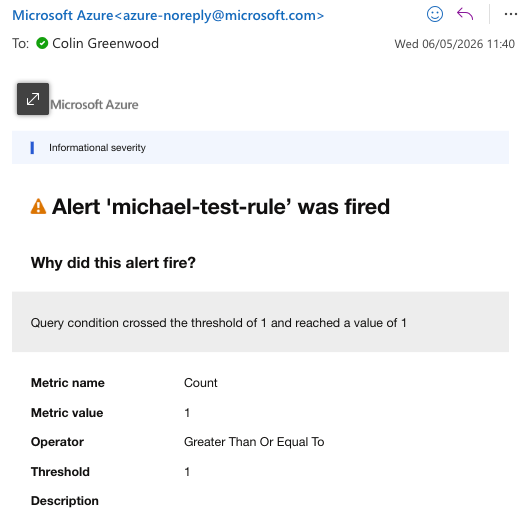

---

### SMS notification

An SMS arrives within seconds showing the severity, alert rule name, and workspace — useful for immediate awareness even without internet access.

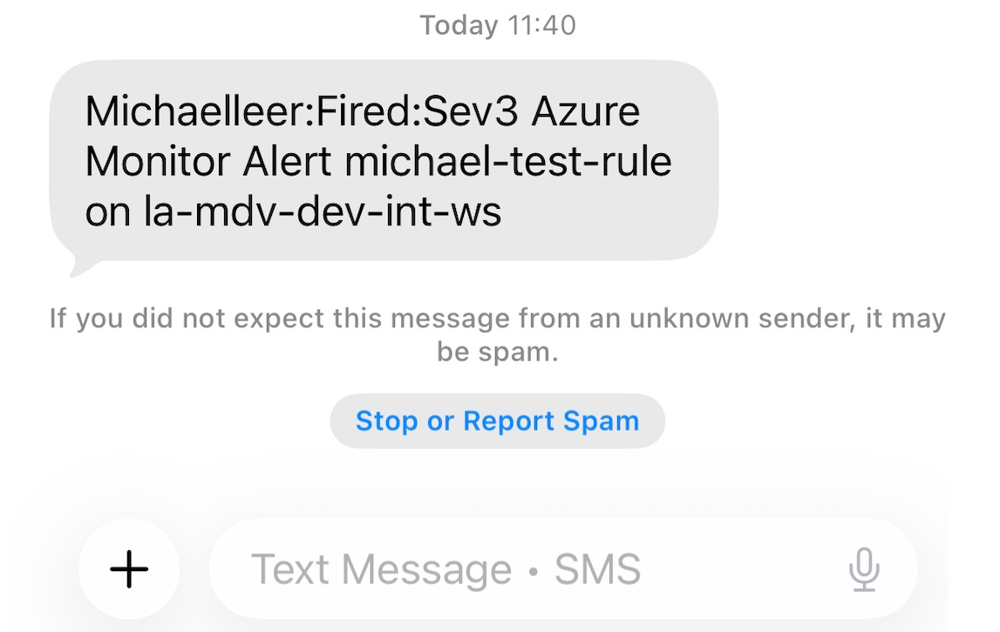
