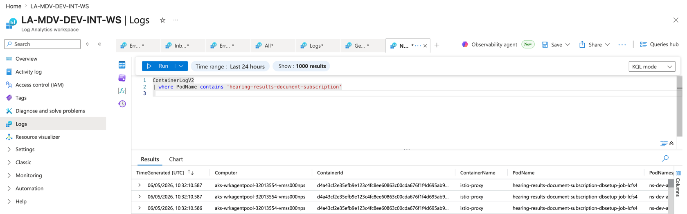
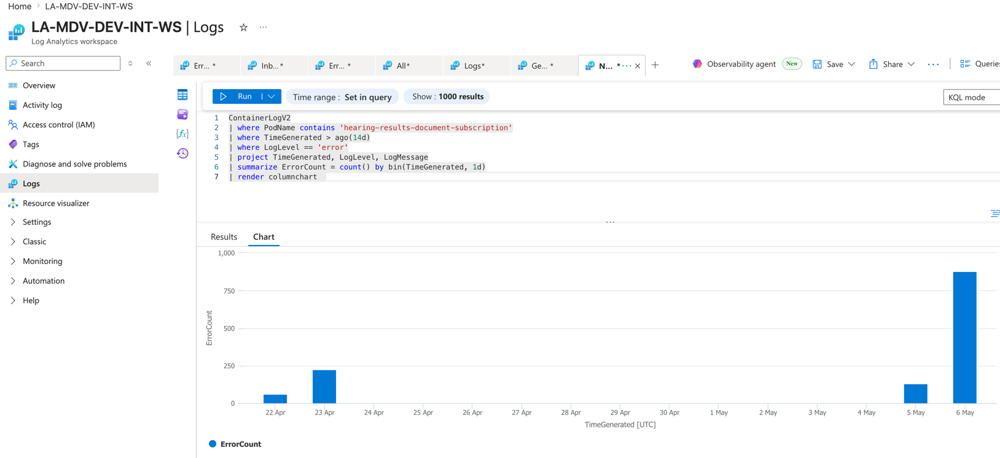
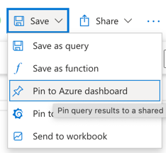
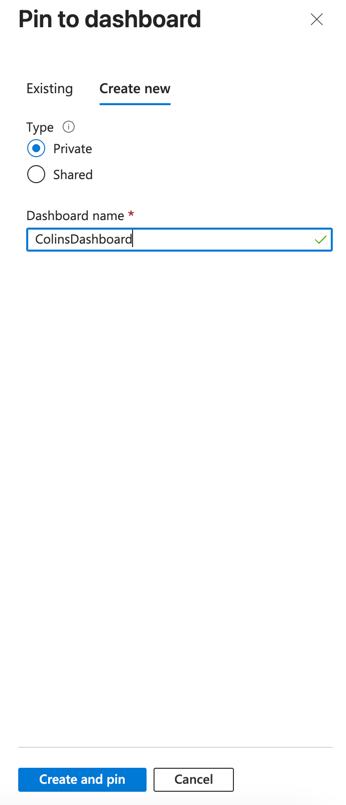
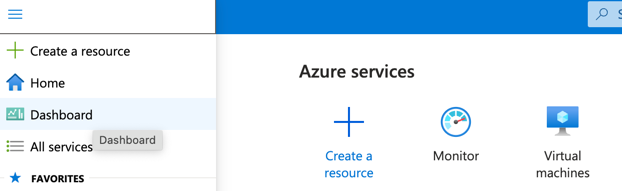
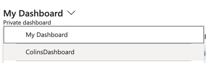
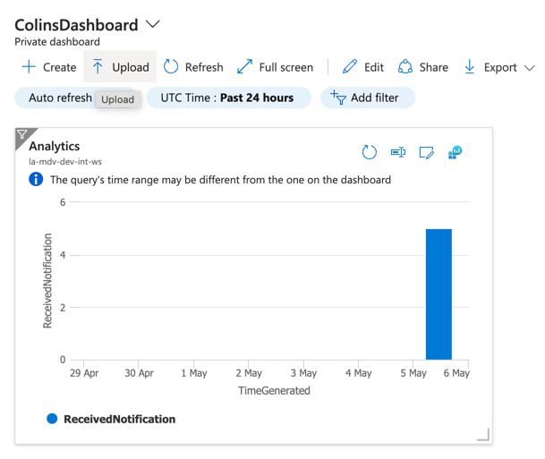
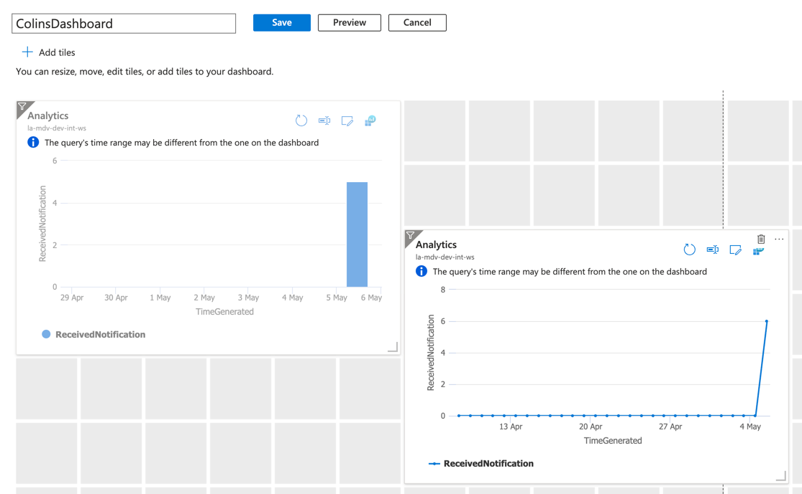
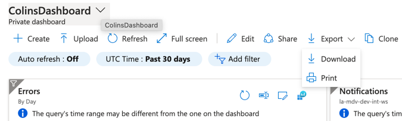
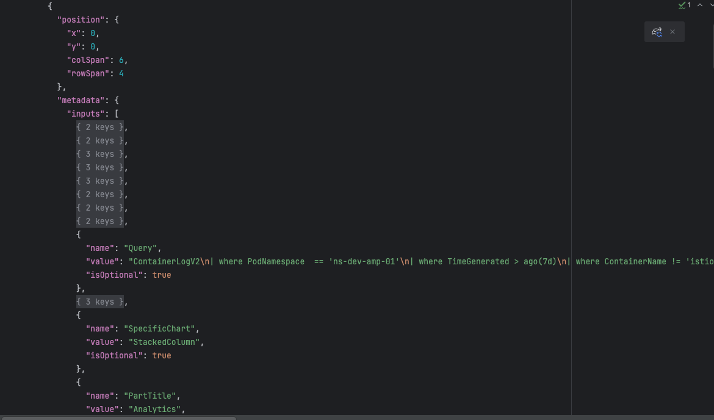

# Azure Dashboard

Step-by-step guide for creating, viewing, editing and exporting an Azure Portal dashboard from KQL queries.

---

## How to create a dashboard tile from a KQL query

### Step 1 — Write and run your query in Log Analytics

Navigate to your **Log Analytics Workspace → Logs** and write your KQL query. Click **Run** to see results in the table below.



---

### Step 2 — Add `render` to turn results into a chart

Append a `render` statement to your query (e.g. `| render columnchart`) and click **Run** again. Switch to the **Chart** tab to see the visualisation.



> See [queries.md](./queries.md) for all available chart types.

---

### Step 3 — Open the Save menu and select Pin to Azure dashboard

Click **Save → Pin to Azure dashboard**.



---

### Step 4 — Create a new dashboard or pin to an existing one

In the **Pin to dashboard** dialog you can either:

- **Existing tab** — select an existing dashboard from the dropdown
- **Create new tab** — give it a name (e.g. `ColinsDashboard`), choose Private or Shared, then click **Create and pin**



> Choose **Private** if the dashboard is just for you. Choose **Shared** to make it visible to others in the subscription.

---

### Step 5 — Navigate to your dashboard

Click **Dashboard** in the left-hand Azure Portal navigation (or hover over the grid icon to see the tooltip).



---

### Step 6 — Find your dashboard in the dropdown

Click the dashboard name at the top left to open the dropdown — all your private and shared dashboards are listed here. Select yours.



---

### Step 7 — View your dashboard

Your pinned chart tile appears on the dashboard. The toolbar gives you options to **Create**, **Upload**, **Refresh**, **Edit**, **Share** and **Export**.



---

### Step 8 — Edit and arrange tiles

Click **Edit** in the toolbar to enter edit mode. You can drag tiles to reposition them, resize them by dragging the corners, and delete unwanted tiles. Click **Save** when done.



---

## Exporting and importing the dashboard JSON

### Export — save your dashboard to source control

1. From your dashboard click **Export → Download**.
2. Azure downloads a JSON file containing all tile definitions and queries.
3. Commit this file to source control so the dashboard can be recreated by anyone on the team.



### The dashboard JSON

The downloaded JSON defines each tile's position, size, KQL query, and chart type. You can edit it directly in VS Code to change queries or add new tiles before re-importing.



### Import — restore or share the dashboard

1. **Azure Portal → Dashboard → Upload** (or **+ New dashboard → Import**).
2. Select the JSON file.
3. The dashboard appears under your private dashboards.

> The JSON is tied to a specific subscription and workspace via `resourceIds`. To point it at a different workspace, find and replace the `resourceIds` value throughout the file before importing.

---

## hearing-results-document-subscription dashboard

The file [`my-dashboard.json`](./my-dashboard.json) contains the full dashboard definition with 5 tiles across 3 rows, scoped to workspace `la-mdv-dev-int-ws` in resource group `rg-mdv-dev-int-01`.

### Layout

```
┌─────────────────────────────┬─────────────────────────────┐
│ Received Notifications      │ Received Notifications      │
│ Last 7 days by hour         │ Last 12 weeks by day        │
│ (line chart)                │ (line chart)                │
├─────────────────────────────┼─────────────────────────────┤
│ Errors By Hour              │ Errors                      │
│ Last 7 days (line chart)    │ Last 7 days (table, top 50) │
├─────────────────────────────┴─────────────────────────────┤
│ Logs — last 12 hours, local time (table, top 500)         │
└───────────────────────────────────────────────────────────┘
```
