# Logic App → Microsoft Teams Alert

Step-by-step guide for creating an Azure Logic App that posts a message to a
Microsoft Teams chat when triggered by an HTTP request (e.g. from an Azure
Monitor Action Group).

> ⚠️ **Prototyping only** — the portal (clickops) steps below are for learning
> and prototyping. Production alert routing is managed via Terraform in
> [cp-amp-terraform-alerts](https://github.com/hmcts/cp-amp-terraform-alerts).

> ℹ️ **Why Logic App instead of Teams Workflows/Power Automate?**  
> The Teams Workflows webhook requires a **Power Automate Premium licence** for
> the HTTP trigger. On HMCTS accounts with a standard M365 licence this connector
> is unavailable. A Logic App runs entirely within your Azure subscription —
> no Power Automate licence required. See [teams-webhook.md](./teams-webhook.md)
> for full background.

> ℹ️ **Why post to a Group Chat rather than a Channel?**  
> Teams surfaces **chat messages with a notification badge** that is hard to
> miss. Channel messages, by contrast, are easy to overlook — the Channels tab
> shows no unread indicator unless you have explicitly followed the channel.
> For alert visibility, a group chat (e.g. `AMP Tech`) is more reliable day-to-day.
>
> 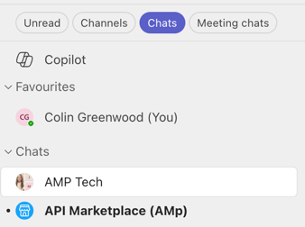

---

## Step 1 — Create the Logic App

In the Azure Portal, create a new **Logic App** resource. Choose the
**Consumption** plan (pay-per-execution, cheapest for low-volume alerts).
Give it a name (e.g. `ColinAlert`) and place it in the same resource group as
your other monitor resources.

Once deployed, the overview page shows the Logic App with no triggers or actions
configured yet.

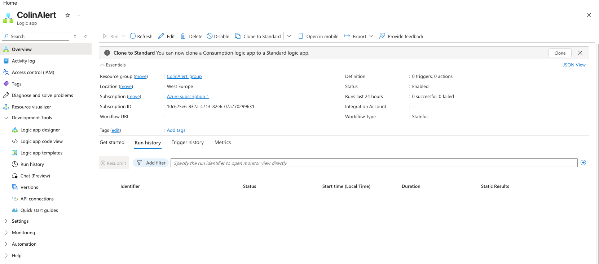

---

## Step 2 — Open Logic App Designer

In the Logic App resource, click **Logic app designer** in the left-hand
navigation under **Development Tools**.

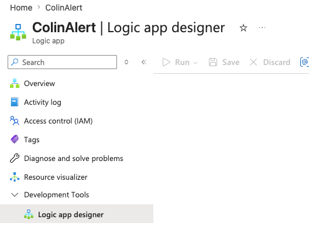

---

## Step 3 — Add a trigger

The designer canvas opens with an **Add a trigger** button in the centre. Click
it to open the trigger search panel.

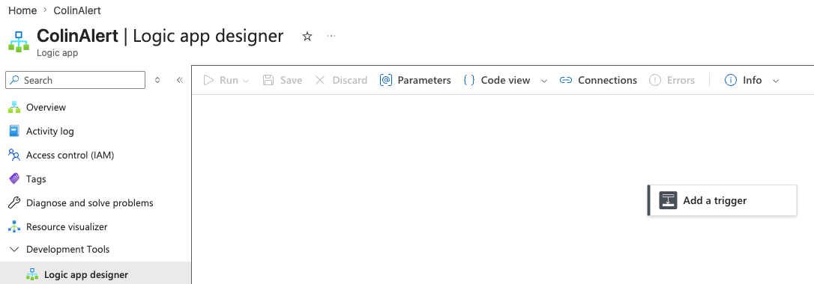

---

## Step 4 — Select "When an HTTP request is received"

Search for `HTTP` and select **When an HTTP request is received**. This creates
a webhook URL that Azure Monitor (or any HTTP client) can POST to.

Leave the **Request Body JSON Schema** blank for now — Azure Monitor will
populate the schema on first fire, or you can paste a sample payload later to
generate it automatically.

After selecting the trigger the card expands to show the HTTP POST URL. The URL
is generated after the first **Save**.

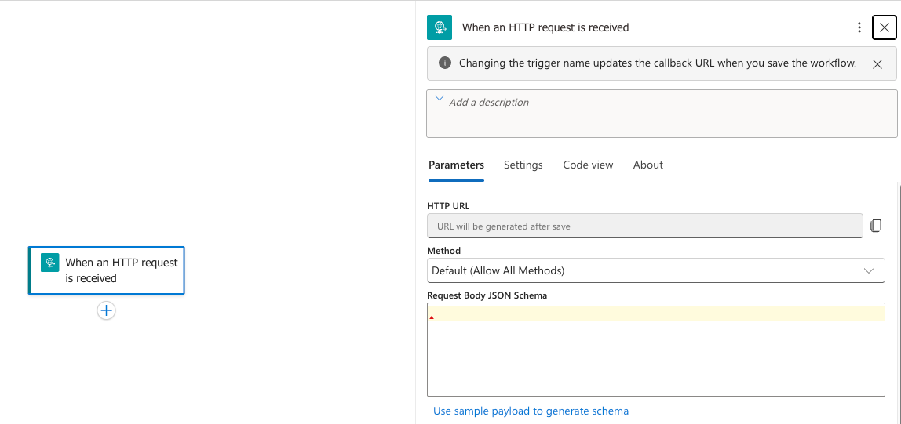

---

## Step 5 — Save to generate the webhook URL

Click **Save** in the designer toolbar. Once saved, the trigger card shows the
generated **HTTP POST URL**. **Copy this URL** — you will need it when
configuring the Azure Monitor Action Group.

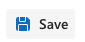

---

## Step 6 — Add an action

Click **Add an action** (or the **+** below the trigger card) to open the action
search panel. You can also add an agent here — for this guide select
**Add an action**.

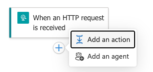

---

## Step 7 — Search for Teams and select "Post message"

Search for `Teams` and select **Microsoft Teams → Post message in a chat or
channel**. Sign in with your Microsoft account when prompted.

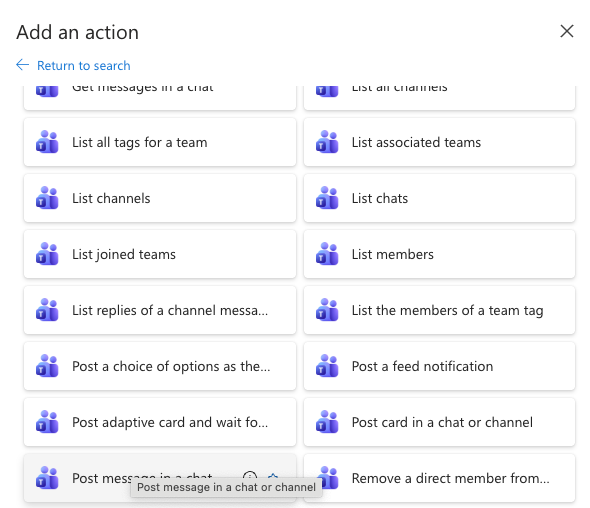

---

## Step 8 — Configure the Teams action

Set the following fields:

| Field | Value |
|---|---|
| **Post in** | Group chat |
| **Group chat** | *(select your Teams group chat, e.g. `AMP Tech`)* |
| **Message** | `Alert fired — check Azure Monitor for details` (or use dynamic content from the trigger body, e.g. `@{triggerBody()?['data']?['essentials']?['alertRule']}`) |

You can use the **dynamic content** picker (lightning bolt icon) to insert fields
from the incoming HTTP payload directly into the message body.

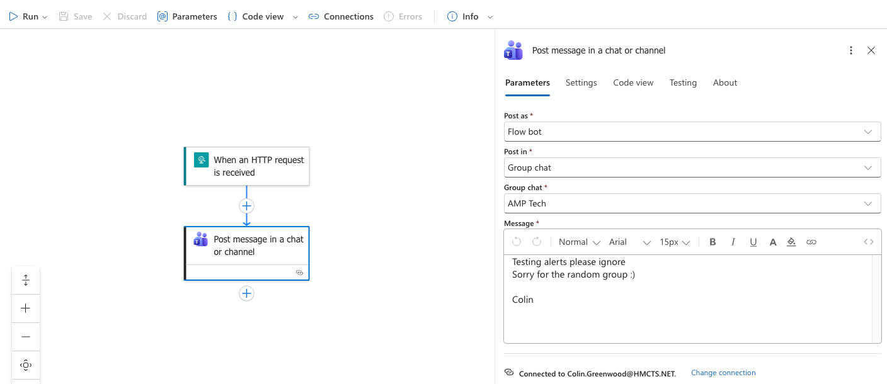

---

## Step 9 — Test the Logic App

Click **Run** (or **Run with payload** to provide a sample JSON body) to
manually trigger the Logic App and verify the Teams message is delivered before
wiring it up to Azure Monitor.

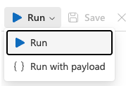

---

## Step 10 — Verify in Teams

Open Microsoft Teams and check the target group chat. If the Logic App ran
successfully a message will appear in the chat.

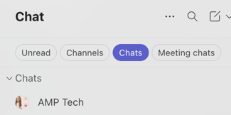

---

## Step 11 — Message received

The message posted by the Logic App appears in the Teams chat, confirming the
end-to-end flow is working.

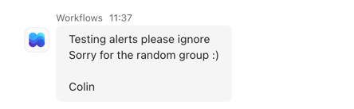

---

## Step 12 — Wire the webhook URL into an Action Group

Now that the Logic App is verified, add it to an Azure Monitor Action Group:

1. Open (or create) your **Action Group** in **Azure Monitor → Alerts →
   Action groups**
2. Go to the **Actions** tab → **+ Add action type**

   | Field | Value |
   |---|---|
   | **Action type** | Webhook |
   | **Name** | `TeamsLogicApp` (or similar) |
   | **URI** | *(paste the HTTP POST URL from Step 5)* |
   | **Enable common alert schema** | Yes |

3. Click **OK** then **Save** the Action Group.

When the alert next fires, Azure Monitor POSTs to the Logic App URL and the
Logic App posts the message into the Teams chat.

---

## Summary

```
Azure Monitor Alert Rule
        │  fires
        ▼
  Action Group (Webhook action)
        │  HTTP POST
        ▼
  Logic App — HTTP trigger
        │  runs
        ▼
  Logic App — Post message action
        │  
        ▼
  Microsoft Teams group chat
```

---

## ⚠️ Limitations for production

### The personal-account problem

The **Microsoft Teams connector** in Logic Apps authenticates using **OAuth
delegated permissions** — it signs in as the user who configured it (in this
case a personal Azure account). This is fine for prototyping but has two
critical problems in production:

| Problem | Impact |
|---|---|
| **Tied to an individual** | If that person leaves or their password/MFA changes, the Logic App silently stops posting to Teams |
| **Not infrastructure-as-code** | Terraform has no way to provision a personal OAuth connection — it cannot be version-controlled or reproduced reliably |

### Production options

#### Option A — Service account (simplest step up)

Create a dedicated shared account (e.g. `amp-alerts@hmcts.gov.uk`), add it to
the Teams channel/chat, and authenticate the Logic App Teams connector as that
account. Credentials can be stored in Key Vault and referenced by Terraform. The
connection is no longer tied to an individual, though it is still a user account
with its own lifecycle management.

#### Option B — Managed Identity + Microsoft Graph API (recommended)

Assign the Logic App a **system-assigned Managed Identity** and grant it
permission to post via the **Microsoft Graph API**
(`POST /chats/{id}/messages` or `/teams/{id}/channels/{id}/messages`).
No user account required — purely service-to-service authentication using Azure
RBAC.

The requirement: Graph API **application permissions** for posting to Teams
require **admin consent** from the HMCTS tenant. Raise a request with IT/an
Entra admin. Once granted, the whole setup is fully Terraform-deployable with no
personal credentials anywhere.

#### Option C — Email only (pragmatic for most cases)

For production on-call alerting, email (via an Action Group notification) is
simpler, more reliable, and requires no Teams permissions at all. Route alerts
to a team distribution list. Teams visibility can come from a separate bot or
integration that HMCTS IT manages centrally.

### What HMCTS production likely uses

The [`cp-amp-terraform-alerts`](https://github.com/hmcts/cp-amp-terraform-alerts)
repo routes to **email, PagerDuty, or OpsGenie** rather than Teams directly.
These are infrastructure-grade alert channels that are independent of any
individual's account or Microsoft licence tier.
