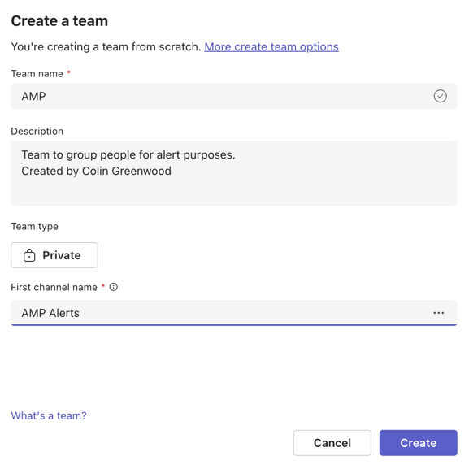
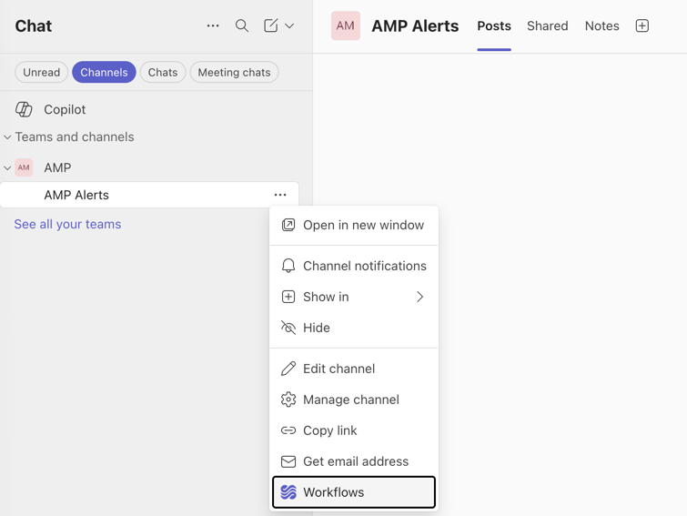
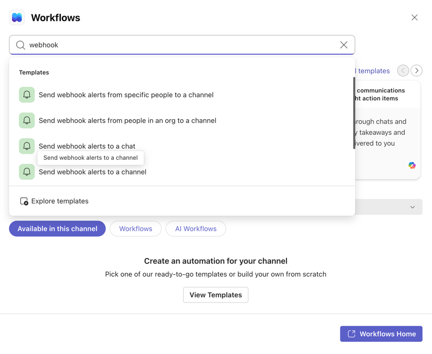
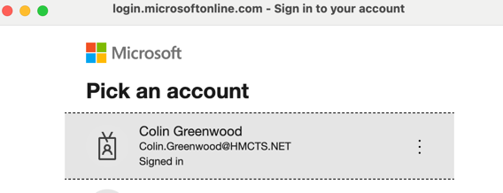
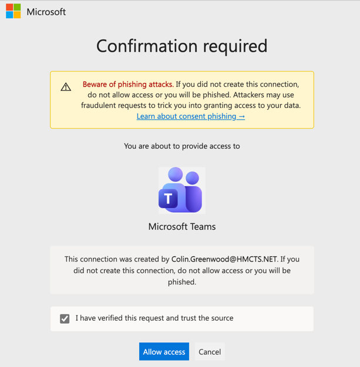
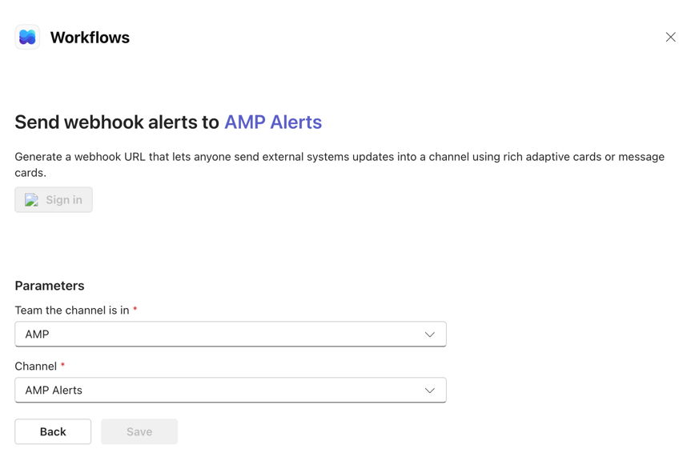

# Sending Azure Alerts to Microsoft Teams

Guide for setting up a Teams webhook via the Workflows app, including a known
issue with the Save button being greyed out on HMCTS accounts.

> ⚠️ **Prototyping only** — production alert routing is managed via Terraform in
> [cp-amp-terraform-alerts](https://github.com/hmcts/cp-amp-terraform-alerts).

---

## Step 1 — Create a Team and channel

Webhooks only work with **channels**, not chats. If you don't have a suitable
team yet, create one: **Teams → + → Create team → From scratch**, give it a name
(e.g. `AMP`) and a first channel name (e.g. `AMP Alerts`).

---

## Step 2 — Open Workflows from the channel

Right-click (or click **···**) on the channel name and select **Workflows**.

---

## Step 3 — Search for the webhook template

In the Workflows panel search for `webhook` and select
**"Send webhook alerts to a channel"**.

---

## Step 4 — Sign in

The workflow requires a Power Automate connection to Microsoft Teams.
Click **Sign in** and pick your account.

---

## Step 5 — Allow access

A confirmation page asks you to allow access to Microsoft Teams on behalf of
the connection. Tick **"I have verified this request and trust the source"** and
click **Allow access**.

---

## Step 6 — ⚠️ Known issue: Save is greyed out

After completing sign-in and Allow access the workflow wizard returns to the
parameters screen with Team `AMP` and Channel `AMP Alerts` correctly selected —
but the **Save button remains greyed out**.

### Why this happens

The Save button stays greyed out when the **Power Automate connection to Teams
has not been fully established**. On HMCTS accounts this is most likely caused
by one of the following:

| Cause | Description |
|---|---|
| **No Power Automate licence** | Workflows is powered by Power Automate. If the account does not have a Power Automate licence (or an M365 licence that includes it) the connection cannot complete. |
| **Admin consent required** | The HMCTS tenant may require an administrator to pre-approve Power Automate connections before individual users can create them. |
| **Conditional access policy** | HMCTS conditional access policies may be blocking the OAuth connection back to Power Automate even after Allow access is clicked. |

### Workarounds to try

1. **Check Power Automate directly** — go to [make.powerautomate.com](https://make.powerautomate.com) and sign in with your HMCTS account. If you see a licensing prompt or are blocked, that confirms a licence/policy issue.

2. **Try from Power Automate directly** — rather than using the Teams Workflows panel, create the flow in Power Automate:
   - Go to [make.powerautomate.com](https://make.powerautomate.com)
   - **+ Create → Automated cloud flow**
   - Search for trigger: **When a HTTP request is received**
   - Action: **Post message in a chat or channel** (Teams connector)
   - Copy the generated webhook URL and use it in the Azure Action Group

   > ⚠️ **"When a HTTP request is received" is a Premium connector** — it only appears if your account has a Power Automate Premium licence. On HMCTS accounts with a standard M365 licence it will not appear in the trigger list (you will only see third-party connectors like Loopio and TeamWherx). This confirms the licence block.

3. **Raise with IT / ask for admin consent** — if the issue is tenant policy, an admin needs to grant consent for Power Automate connections at [entra.microsoft.com](https://entra.microsoft.com) → Enterprise applications → Power Automate.

4. **Recommended alternative — Azure Logic App** — bypasses the Teams/Power Automate licensing issue entirely as it runs inside your Azure subscription with no Power Automate licence required. See the [Logic App → Teams guide](#logic-app--teams-recommended) below.

---

---

## Logic App → Teams (recommended)

An Azure Logic App runs entirely within your Azure subscription and has its own
HTTP trigger — no Power Automate licence required. This is the practical solution
for HMCTS accounts.

### Step 1 — Create a Logic App

1. **Azure Portal → Create a resource → Logic App**
2. Choose **Consumption** plan (pay per execution, cheapest for low-volume alerts)
3. Give it a name e.g. `la-amp-teams-alert`, same resource group as your other monitor resources
4. Click **Review + create → Create**

### Step 2 — Add the HTTP trigger

1. Open the Logic App → **Logic app designer**
2. Click **Add a trigger** → search for `HTTP`
3. Select **When a HTTP request is received**
4. Leave the schema blank for now — Azure Monitor will populate it on first fire
5. **Save** — a webhook URL is generated at the top of the trigger card. **Copy this URL.**

### Step 3 — Add a Teams action

1. Click **+ New step** → search for `Teams`
2. Select **Microsoft Teams → Post message in a chat or channel**
3. Sign in with your HMCTS account when prompted
4. Set:

   | Field | Value |
   |---|---|
   | Post in | Channel |
   | Team | AMP |
   | Channel | AMP Alerts |
   | Message | `🚨 Alert fired: @{triggerBody()?['data']?['essentials']?['alertRule']}` |

5. **Save** the Logic App

### Step 4 — Wire the URL into the Action Group

1. Open your Action Group (`ColinsAG`) → **Edit**
2. Go to the **Actions** tab → **+ Add action**

   | Field | Value |
   |---|---|
   | Action type | Webhook |
   | Name | `TeamsLogicApp` |
   | URI | *(paste the Logic App HTTP trigger URL)* |
   | Enable common alert schema | Yes |

3. **Save** the Action Group

When the alert next fires, Azure Monitor POSTs to the Logic App URL → the Logic
App posts a message into the **AMP Alerts** Teams channel.

---

## Background — why Connectors no longer work

The old **Incoming Webhook connector** (accessible via channel → Connectors) was
retired by Microsoft in late 2024. The Workflows / Power Automate approach is the
official replacement. If your organisation has not yet enabled Power Automate for
all users this transition can block webhook setup until licences or admin consent
are in place.
