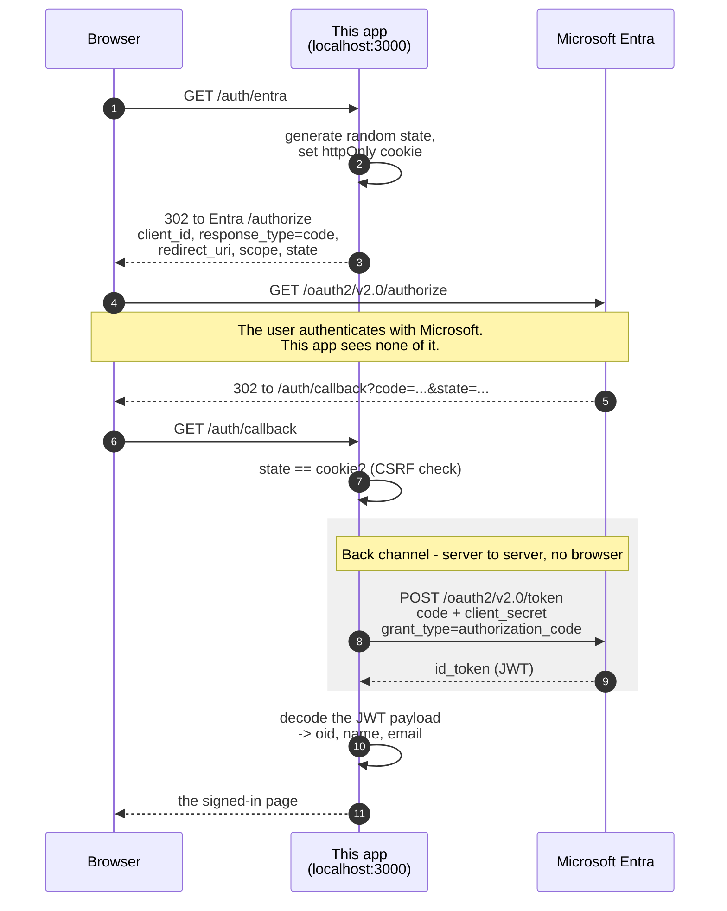

# entra-node-login-demo

Sign in with Microsoft Entra and show who signed in. One button, one redirect, one page of claims.

Node, not Spring Boot - deliberately, because it mirrors the prototype this was taken from and keeps
the OAuth flow visible rather than hidden behind framework configuration. Three routes, 134 lines,
two dependencies.

## What it does

1. `/` - a page with a **Sign in with Microsoft Entra** button
2. Cick on the sign in button and the browser is redirected to Entra
3. ( Entra handles the registration of user and sign in and then redirects back to /auth/callback )
4. /auth/callback` - the app receives a jwt that contains the user's **oid**, **name** and **email**
5. We display the contents of the jwt to the now signed in user

## Run it

Node 20.6 or later. Everything but the secret is defaulted to the HMCTS sandbox tenant, so:

```bash
cd entra-node-login-demo
npm install
export ENTRA_CLIENT_SECRET=...     # from the sandbox app registration
npm start                          # http://localhost:3100
```

The secret is the only thing with no default, so it is the only thing that can be missing, and the
app refuses to start without it rather than failing later during the token exchange:

```
Cannot start: ENTRA_CLIENT_SECRET is not set.

  export ENTRA_CLIENT_SECRET=...   # from the Entra app registration
  npm start
```

**Export it. Do not put it in a file here** - exported values win over anything else, and a secret in
a file is a secret waiting to be committed.

### Port 3100, and why

It matches the redirect URI registered on the sandbox app registration. Entra only redirects back to
an address registered there, so on another port sign-in fails with `AADSTS50011` before the user sees
a login form.

That is also the port `hmcts-api-marketplace`'s prototype-kit uses, so the two cannot run at once.
Either stop that one, or add `http://localhost:<other-port>/auth/callback` to the app registration's
redirect URIs and set `PORT` to match.

### Pointing it at a different tenant

Every default can be overridden from the environment: `ENTRA_CLIENT_ID`, `ENTRA_AUTHORIZE_ENDPOINT`,
`ENTRA_TOKEN_ENDPOINT`, `ENTRA_REDIRECT_URI`, `PORT`. The two endpoints come from the tenant's
`/.well-known/openid-configuration`.

## What it logs

Each route as it is hit, then the claims:

```
-> GET /auth/entra
   redirecting to Entra  state=de349f5f...  prompt=none
-> GET /auth/callback
   back from Entra  code=present  state=de349f5f...  error=none
   token exchange ok
   claims  oid=11111111-2222-3333-4444-555555555555  name=Ada Lovelace  email=ada@example.net
```

The same `state` either side is the CSRF check passing, and the quickest way to see a failed sign-in
for what it is. Three things are deliberately absent: the request path is logged without its query
string, because the callback's carries the authorization code; the code is logged as `present` or
`MISSING` rather than by value; and the ID token is never logged at all, only the claims read out of
it.

## The flow



Three things are worth knowing before the detail:

1. **The user's password never reaches this application.** They type it on Microsoft's own pages.
   This app never sees it, never stores it, and could not leak it.
2. **The browser never carries a token.** It carries a short-lived, single-use *authorization code*.
   The JWT is fetched separately, server to server. This distinction is the whole security design,
   and it is the thing most often misread.
3. **Entra knows who you are, and nothing else.** It holds `oid`, name, email and the credential. It
   has no concept of organisation, role, team or ownership - those belong in our database, keyed by `oid`.

## Two channels

**Front channel** - through the browser, visible in the address bar, in history, in any proxy log.
It carries only the authorization code.

**Back channel** - a direct HTTPS request from the Node process to Microsoft. It carries the token.

`response_type=code` is what selects this. The alternative, the old implicit flow
(`response_type=token`), returned the token itself into the browser's URL, where it would land in
browser history, server logs and `Referer` headers. The authorization code flow exists to avoid
that, and it is why the code arriving at `/auth/callback` is useless to anyone who steals it:
redeeming it also needs the client secret, which only the server has.

## Step by step

### `/auth/entra` - starting the flow

Generates 16 random bytes as `state`, stores it in an `httpOnly` cookie, and redirects to the
tenant's authorize endpoint with `client_id`, `response_type=code`, `redirect_uri`,
`scope=openid profile email` and that `state`.

`state` is the CSRF defence for the round trip. Because the callback is a plain GET that anyone can
navigate a victim's browser to, the cookie is what proves *this browser* started *this* flow. A
callback whose `state` does not match the cookie is rejected.

`?prompt=login` is allow-listed for local demos: it makes Microsoft show its form even when the
browser already has a session, which is otherwise why sign-in appears to "just work" with no way to
try a different account.

### `/auth/callback` - the code comes back

Microsoft redirects the browser back with `?code=...&state=...`, or `?error=...`. Before anything
else: no `error`, and `state` matches the cookie.

Note what has *not* happened yet. At this point the app has a code and nothing else - no token, no
claims, no idea who the user is.

### Redeeming the code

A server-side `POST` to the token endpoint with `grant_type=authorization_code`, carrying the code,
the `redirect_uri` it was issued for, and the client secret. **This is where the JWT arrives** -
`id_token` in the response body, over TLS, direct from Microsoft to the Node process.

### Reading the claims

A JWT is three base64url segments separated by dots: `header.payload.signature`. The payload is
`[1]`, decoded as JSON, yielding `oid`, `name`, and `email` - or `emails[0]`, because External ID
returns an array in some configurations.

**This decodes but does not verify.** It never checks the signature against the tenant's public
keys. The justification is narrow: the token came straight off a TLS connection to the token
endpoint, authenticated with our own client secret, so nobody was in a position to substitute one.

That reasoning holds *here and only here*. A decoded-but-unverified JWT is forgeable by anyone who
can type base64 - the signature is the only thing that makes a claim trustworthy. If a token ever
arrives from anywhere else, a browser or an API caller, it must be verified against the tenant's
JWKS (`/discovery/v2.0/keys`) before a single claim is believed.

## What `oid` is

**Object ID** - the GUID of the user's object in the Entra directory. The primary key of the row
representing that human in the tenant.

| Property | Consequence |
|---|---|
| **Immutable** | Never changes for the life of the account |
| **Survives rename** | Name change, email change - same `oid` |
| **Tenant-wide** | Every application in the tenant sees the *same* `oid` for the same person |

### `oid` vs `sub`

An ID token carries both, and they are not interchangeable. `sub` is also a stable identifier, but
it is **pairwise** - derived per `(user, application)`. The same person signing into two
applications in the same tenant gets two *different* `sub` values. That is deliberate: it stops two
applications correlating their users by comparing identifiers.

`oid` is the opposite: the same value everywhere in the tenant. That makes it the right thing to key
your own data on - not email, which changes, and not `sub`, which a second service would compute
differently for the same person.

## What a real integration must change

This demo shows the flow. Two things are deliberately not production-shaped:

1. **Verify the ID token signature** against the tenant's JWKS before trusting any claim. The
   justification above is specific to this one call path and does not generalise.
2. **Carry identity in a real session.** This demo renders the claims and forgets them, which is why
   it needs no session at all. Anything that keeps a user signed in needs one - and it should hold
   the `oid`, not the name or email.

In Spring Boot, `spring-boot-starter-oauth2-client` does both of these for you, along with the
`state` handling and the token exchange - see `entra-auth-demo` in this repo for the resource-server
half. This demo hand-rolls them precisely so the steps are visible.

## The tests

`npm test` uses Node's built-in test runner, with [supertest](https://github.com/ladjs/supertest) to
drive the app. Entra is a stub HTTP server on an ephemeral port rather than a mocked `fetch`, so the
real request in `entra/client.js` is exercised.

They cover the round trip as a browser performs it - start at `/auth/entra`, carry the cookie, come
back with the code - and three refusals: a `state` that does not match the cookie, no cookie at all,
and an `error` from Entra.

## Not in the CI matrix

`.github/workflows/run-tests.yml` runs `./gradlew clean test` in each module it lists. This module
has no Gradle build, so adding it there would fail. It has no tests to run.
