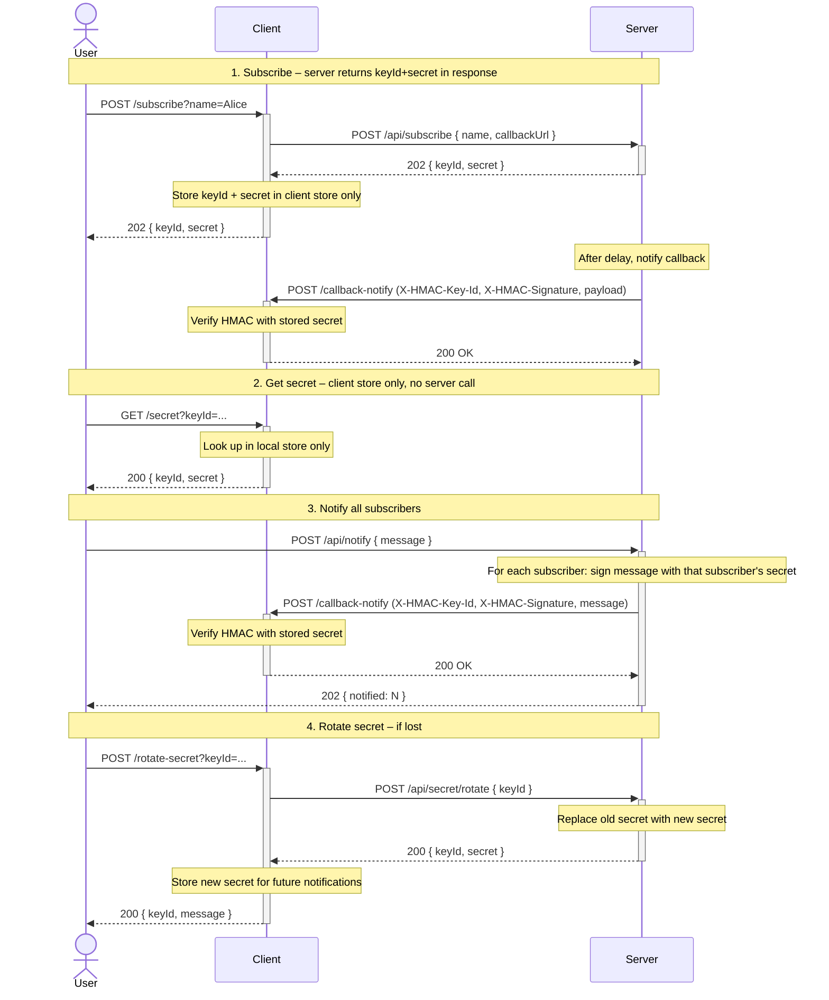

# Outbound Auth HMAC Demo – Client & Server

This folder contains two **independent** REST services (each with its own Gradle build):

- **client/** – exposes a callback-notify endpoint and can subscribe to the server
- **server/** – accepts subscriptions and notifies the client on its callback URL with HMAC authentication

## Flow

1. **Subscribe:** User subscribes via the client; client sends name and callbackUrl to the server; server generates keyId and secret, returns them in the response; client stores in its local store only (server does not expose any endpoint to fetch secret). Server then sends a welcome notification to the client’s callback with HMAC.
2. **Get secret:** User can read the secret from the client only via GET /secret?keyId=... (client store only; no server call).
3. **Notify all:** A caller asks the server to notify all subscribers with a message; server signs the message per subscriber and POSTs to each client’s callback.
4. **Rotate secret:** If the secret is lost, user asks the client to rotate; client calls the server to rotate; client stores the new secret and uses it for future notifications.

## Sequence diagram (complete flow)



## Projects

## Config

**Server** (`server/src/main/resources/application.yml`)

- `server.port` / `SERVER_PORT` – default `8080`

**Client** (`client/src/main/resources/application.yml`)

- `server.port` / `SERVER_PORT` – default `8081`
- `client.server-base-url` / `SERVER_BASE_URL` – default `http://localhost:8080`
- `client.callback-url` / `CALLBACK_URL` – default `http://localhost:8081/callback-notify`

## Run

Each project is built and run from its own directory:

```bash
# Terminal 1 – start server
cd server && ./gradlew bootRun

# Terminal 2 – start client
cd client && ./gradlew bootRun
```

Then:

```bash
curl -X POST "http://localhost:8081/subscribe?name=Alice"
```

Server will call `http://localhost:8081/callback-notify` with body `Alice, you have a news` and HMAC headers.  
Client verifies the HMAC and logs the payload.

## Docker

The `docker/` folder contains Dockerfiles and docker-compose to run both apps in containers:

- **docker/Dockerfile.client** – builds the client (multi-stage: Gradle build, then JRE run)
- **docker/Dockerfile.server** – builds the server (multi-stage: Gradle build, then JRE run)
- **docker/docker-compose.yml** – starts server (port 8080) and client (port 8081), with client pointing at server via `SERVER_BASE_URL=http://server:8080` and `CALLBACK_URL=http://client:8081/callback-notify`

From the **repo root** (parent of `outbound-auth-hmac-demo`):

```bash
docker compose -f outbound-auth-hmac-demo/docker/docker-compose.yml up --build
```

Then:

```bash
curl -X POST "http://localhost:8081/subscribe?name=Alice"
```

## Curl scripts

In `scripts/` there are curl examples:

- **Server:** `./scripts/curl-health.sh` → `GET /actuator/health`
- **Client:** `./scripts/curl-subscribe.sh [name]` → `POST /subscribe` (client calls server; returns keyId and secret; default name=Guest)
- **Client:** `./scripts/curl-get-secret.sh <keyId>` → `GET /secret` (from client store only; keyId from subscribe)
- **Client:** `./scripts/curl-rotate-secret.sh <keyId>` → `POST /rotate-secret` (client calls server to rotate secret and stores new one; keyId from subscribe flow / client logs)

Use `BASE_URL` for the server (default 8080) and `CLIENT_URL` for the client (default 8081). See `scripts/README.md`.

## OpenAPI specs

- **Server** – `server/src/main/resources/openapi/openapi-spec.yml` (secret, subscribe).
- **Client** – `client/src/main/resources/openapi/openapi-spec.yml` (subscribe, callback-notify).

To validate:

```bash
cd server && ./gradlew openApiValidate
cd client && ./gradlew openApiValidate
```

Validation runs as part of `./gradlew check` in each project.

## Tests

Run tests in each project separately:

```bash
cd client && ./gradlew clean test
cd server && ./gradlew clean test
```


